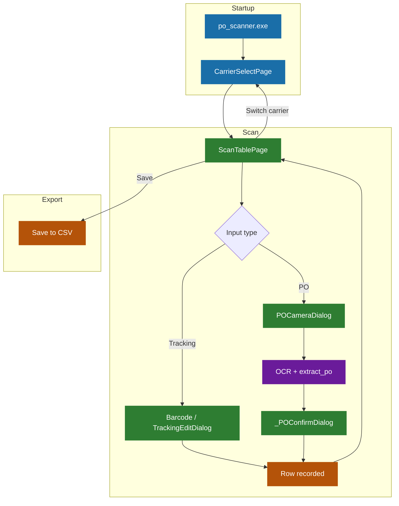

# PO Scanner

Internal tool for scanning and recording PO numbers via camera OCR.

---

## App Flow



---

## Project Structure

```
po_scanner.py       Main app (PyQt5 UI, camera, PO logic)
ocr_core.py         OCR subprocess (RapidOCR + ONNX, runs as separate process)
settings_app.py     Settings UI (config editor, Excel generator)

src/
  ocr/              RapidOCR engine wrapper
  preprocessing/    Image preprocessing pipeline
  utils/            PO extraction logic

ui/
  ui_utils.py       Shared UI utilities
  how_to_use.py     How-to-use dialog

config/
  config.yaml       User-editable settings
  camera_state.json Last used camera index

PO_Import_v2.bas    VBA macro for Excel (import CSV → day sheets)
```

---

## Build Requirements

- Python 3.10 + virtualenv (`venv\`)
- PyInstaller (`pip install pyinstaller`)
- Inno Setup 6 — https://jrsoftware.org/isdl.php

---

## Build

### App only (fast — use when only po_scanner.py / settings_app.py changed)
```
build_app.bat
```

### OCR runtime (slow — use when ocr_core.py or src/ changed)
```
build_ocr.bat
```

### Package installer
After both `dist\po_scanner\` and `dist\ocr_runtime\` are built:
```
# Open po_scanner.iss in Inno Setup and compile
# Output: dist\PO_Scanner_Setup.exe
```

---

## Install (new device)

Run `PO_Scanner_Setup.exe` — no other dependencies required.  
Default install path: `C:\PO Scanner` (can be changed during install).

---

## Excel Setup

1. Open Settings → Generate Yearly Excel
2. Select a fully-formatted Trial `.xlsm` as template
3. Choose output folder and year → Generate 12 Files
